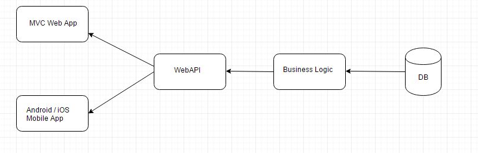

# Arquitetura

##### O Sistema usa o padrão de projeto MVC 

<h1 align="center">
    
</h1>

##### A camada referente a Model e Controller foi desenvolvida em uma projeto separado com a intenção de desenvolver outra camada View que utilize o mesmo backend, deixando a arquitetura do sistemas da forma que está exemplificado na imagem abaixo.

<h1 align="center">

</h1>

##### Neste modelo exemplificado na imagem, as camadas de Model e Controller estão abstraidas como Business Logic, mas mesmo nesse modelo essa separação continuará existindo.

###### [View atual - Lincah Frontend](https://github.com/DiogoFGouvea/lincah-frontend)
